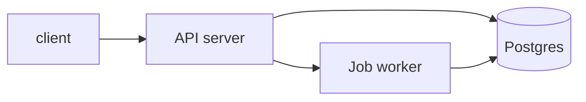

# Architecture

```mermaid
flowchart LR
  client --> api[API server] --> db[(Postgres)]
  api --> worker[Job worker] --> db
```

## Components

- The API server handles requests and queues jobs.
- The job worker runs exports and emails the download link.
